# Mapa de Dependências — SIFAP Legado

> **Trilha:** [Kit do Time](../README.md) › [Estágio 1](README.md) › **Mapa de Dependências**

**Artefato preenchido pelo time durante o Estágio 1 — Passo 3.** Registra as dependências entre programas Natural e DDMs Adabas que sustentam o escopo selecionado.

| Campo | Valor |
|---|---|
| **Público-alvo** | Todas as duplas, com liderança da Dupla 2 (Arquitetura) |
| **Pré-requisitos** | Catálogo de regras com as origens identificadas |
| **Estágio** | Estágio 1 — Arqueologia |
| **Resultado esperado** | Diagrama Mermaid e tabelas de arestas com evidência `arquivo:linha` |

> [!IMPORTANT]
> Mapeie apenas as dependências que explicam o escopo selecionado: programas `.NSN` que chamam outros programas (`CALLNAT`, `FETCH`) e programas que acessam DDMs (`READ`, `FIND`, `STORE`, `UPDATE`, `DELETE`). Toda aresta precisa estar apoiada em `arquivo:linha` — nenhuma inferência sem evidência. Este mapa alimenta as hipóteses de fatiamento em [`discovery-report.md`](discovery-report.md).

> [!NOTE]
> Guia passo a passo: [`GUIDE.md`](GUIDE.md).

**Time**: <!-- preencher -->
**Escopo**: `01-archaeology/legacy-sifap/natural-programs/` — todos os 24 membros, rastreamento recursivo
**Data**: 2026-09-10
**Diagrama isolado**: [`dependency-map.mmd`](dependency-map.mmd)

> [!NOTE]
> Toda aresta abaixo saiu de uma declaração real no código. Nada foi inferido por nome de arquivo. Os números de arquivo Adabas vêm dos DDMs (150/151/152/153), não dos comentários de cabeçalho dos programas — que estão errados, conforme [`business-rules-catalog.md`](business-rules-catalog.md#números-de-arquivo--resolvido).

---

## Diagrama Mermaid

```mermaid
%%{init: {'theme':'neutral','themeVariables':{'fontFamily':'ui-sans-serif, system-ui, sans-serif','primaryColor':'#F5F5F5','primaryTextColor':'#171717','primaryBorderColor':'#171717','lineColor':'#525252','secondaryColor':'#FFFFFF','tertiaryColor':'#FAFAFA','background':'#FFFFFF'}}}%%
flowchart TD
    classDef prog fill:#F5F5F5,stroke:#171717,color:#171717
    classDef sub fill:#FFFFFF,stroke:#171717,color:#171717,stroke-width:2px
    classDef copy fill:#FAFAFA,stroke:#A3A3A3,color:#404040
    classDef data fill:#FFFFFF,stroke:#525252,color:#171717
    classDef seq fill:#FAFAFA,stroke:#A3A3A3,color:#404040

    JCL1["SIFAPJ01 - folha mensal"]:::prog
    JCL2["SIFAPJ02 - relatorios"]:::prog

    BATCHPGT["BATCHPGT.NSP"]:::prog
    BATCHCON["BATCHCON.NSP"]:::prog
    BATCHREL["BATCHREL.NSP"]:::prog
    CADBENEF["CADBENEF.NSP"]:::prog
    CADDEPEN["CADDEPEN.NSP"]:::prog
    CADPROG["CADPROG.NSP"]:::prog
    CONSBENF["CONSBENF.NSP"]:::prog
    CALCCORR["CALCCORR.NSP"]:::prog
    CALCDSCT["CALCDSCT.NSP"]:::prog
    VALDOCS["VALDOCS.NSP"]:::prog
    RELPGT["RELPGT.NSP"]:::prog
    RELAUDIT["RELAUDIT.NSP"]:::prog

    VALELEG["VALELEG.NSN"]:::sub
    CALCBENF["CALCBENF.NSN"]:::sub
    SUBVALCP["SUBVALCP.NSN"]:::sub
    SUBVALNI["SUBVALNI.NSN"]:::sub
    VALBENEF["VALBENEF.NSN"]:::sub

    CCAUDIT["CCAUDIT.NSC"]:::copy
    CCVALCPF["CCVALCPF.NSC"]:::copy

    BENEFIC[("BENEFIC - FNR 150")]:::data
    SOCPROG[("SOCPROG - FNR 151")]:::data
    PAYMENT[("PAYMENT - FNR 152")]:::data
    AUDIT[("AUDIT - FNR 153")]:::data

    WKF01E[/"CMWKF01 - extrato remessa"/]:::seq
    WKF02[/"CMWKF02 - rejeitados"/]:::seq
    WKF01R[/"CMWKF01 - retorno CNAB"/]:::seq
    WKF01A[/"CMWKF01 - copia arquivamento"/]:::seq
    PRT01[/"CMPRT01 - impressora"/]:::seq

    JCL1 --> BATCHPGT
    JCL2 --> BATCHREL
    JCL2 --> RELPGT

    BATCHPGT ==>|CALLNAT| SUBVALCP
    BATCHPGT ==>|CALLNAT| VALELEG
    BATCHPGT ==>|CALLNAT| CALCBENF
    CADBENEF ==>|CALLNAT| SUBVALCP
    CADBENEF ==>|CALLNAT| SUBVALNI
    CADBENEF ==>|CALLNAT| VALBENEF
    CALCCORR ==>|CALLNAT| SUBVALCP
    CONSBENF ==>|CALLNAT| SUBVALCP
    VALDOCS ==>|CALLNAT| SUBVALNI

    BATCHPGT -.->|INCLUDE| CCAUDIT
    BATCHCON -.->|INCLUDE| CCAUDIT
    CADBENEF -.->|INCLUDE| CCAUDIT
    CADDEPEN -.->|INCLUDE| CCAUDIT
    CADPROG -.->|INCLUDE| CCAUDIT
    CALCCORR -.->|INCLUDE| CCAUDIT
    CONSBENF -.->|INCLUDE| CCAUDIT
    CADDEPEN -.->|INCLUDE| CCVALCPF
    SUBVALCP -.->|INCLUDE| CCVALCPF

    BATCHPGT -->|READ| BENEFIC
    BATCHPGT -->|FIND| SOCPROG
    BATCHPGT -->|READ FIND STORE| PAYMENT
    CALCBENF -->|FIND| BENEFIC
    CALCBENF -->|FIND| SOCPROG
    CALCBENF -->|STORE| PAYMENT
    VALELEG -->|FIND| BENEFIC
    VALELEG -->|FIND| SOCPROG
    CALCDSCT -->|FIND| BENEFIC
    CALCDSCT -->|FIND UPDATE| PAYMENT
    CALCCORR -->|READ UPDATE| PAYMENT
    BATCHCON -->|FIND UPDATE| PAYMENT
    BATCHCON -->|READ STORE| AUDIT
    BATCHREL -->|READ| PAYMENT
    BATCHREL -->|FIND| BENEFIC
    CADBENEF -->|FIND STORE UPDATE| BENEFIC
    CADDEPEN -->|FIND UPDATE| BENEFIC
    CADPROG -->|FIND STORE| SOCPROG
    CONSBENF -->|FIND| BENEFIC
    CONSBENF -->|READ| PAYMENT
    RELPGT -->|READ| PAYMENT
    RELPGT -->|FIND| BENEFIC
    RELAUDIT -->|READ HISTOGRAM| AUDIT
    CCAUDIT -->|READ STORE| AUDIT

    BATCHPGT -->|WRITE| WKF01E
    BATCHPGT -->|WRITE| WKF02
    WKF01R -->|READ| BATCHCON
    BATCHREL -->|WRITE| WKF01A
    BATCHREL --> PRT01
    RELPGT --> PRT01
    RELAUDIT --> PRT01
```



Legenda: seta grossa = `CALLNAT`; seta tracejada = `INCLUDE`; cilindro = arquivo Adabas; paralelogramo = arquivo sequencial ou impressora do JCL.

---

## Arestas Programa → Programa

### `CALLNAT` — 9 arestas

| # | De | Para | Tipo | Evidência |
|---|---|---|---|---|
| 1 | `BATCHPGT.NSP` | `SUBVALCP.NSN` | `CALLNAT` | `BATCHPGT.NSP:276` |
| 2 | `BATCHPGT.NSP` | `VALELEG.NSN` | `CALLNAT` | `BATCHPGT.NSP:369` |
| 3 | `BATCHPGT.NSP` | `CALCBENF.NSN` | `CALLNAT` | `BATCHPGT.NSP:381` |
| 4 | `CADBENEF.NSP` | `SUBVALCP.NSN` | `CALLNAT` | `CADBENEF.NSP:161` |
| 5 | `CADBENEF.NSP` | `SUBVALNI.NSN` | `CALLNAT` | `CADBENEF.NSP:196` |
| 6 | `CADBENEF.NSP` | `VALBENEF.NSN` | `CALLNAT` | `CADBENEF.NSP:263` |
| 7 | `CALCCORR.NSP` | `SUBVALCP.NSN` | `CALLNAT` | `CALCCORR.NSP:160` |
| 8 | `CONSBENF.NSP` | `SUBVALCP.NSN` | `CALLNAT` | `CONSBENF.NSP:136` |
| 9 | `VALDOCS.NSP` | `SUBVALNI.NSN` | `CALLNAT` | `VALDOCS.NSP:109` |

Todos os 9 destinos existem em `natural-programs/`. Nenhuma referência quebrada de `CALLNAT`.

### `INCLUDE` — 9 arestas

| # | De | Para | Tipo | Evidência |
|---|---|---|---|---|
| 1 | `BATCHPGT.NSP` | `CCAUDIT.NSC` | `INCLUDE` | `BATCHPGT.NSP:594` |
| 2 | `BATCHCON.NSP` | `CCAUDIT.NSC` | `INCLUDE` | `BATCHCON.NSP:345` |
| 3 | `CADBENEF.NSP` | `CCAUDIT.NSC` | `INCLUDE` | `CADBENEF.NSP:418` |
| 4 | `CADDEPEN.NSP` | `CCAUDIT.NSC` | `INCLUDE` | `CADDEPEN.NSP:235` |
| 5 | `CADPROG.NSP` | `CCAUDIT.NSC` | `INCLUDE` | `CADPROG.NSP:176` |
| 6 | `CALCCORR.NSP` | `CCAUDIT.NSC` | `INCLUDE` | `CALCCORR.NSP:243` |
| 7 | `CONSBENF.NSP` | `CCAUDIT.NSC` | `INCLUDE` | `CONSBENF.NSP:314` |
| 8 | `CADDEPEN.NSP` | `CCVALCPF.NSC` | `INCLUDE` | `CADDEPEN.NSP:230` |
| 9 | `SUBVALCP.NSN` | `CCVALCPF.NSC` | `INCLUDE` | `SUBVALCP.NSN:94` |

Ambos os copycodes existem. Nenhuma referência quebrada de `INCLUDE`.

### `USING` — áreas de dados compartilhadas, 23 arestas

Dependência de compilação, não de execução. Um módulo que muda a LDA obriga a recompilar 13 outros.

| Área | Módulos que a usam | Total |
|---|---|---|
| `LDASIFAP.NSL` | `BATCHCON:21`, `BATCHPGT:30`, `BATCHREL:23`, `CADDEPEN:13`, `CADPROG:13`, `CALCBENF:18`, `CALCCORR:14`, `CALCDSCT:13`, `CONSBENF:20`, `RELAUDIT:19`, `RELPGT:18`, `VALBENEF:27`, `VALELEG:17` | 13 |
| `PDAVALID.NSA` | `BATCHPGT:28`, `CADBENEF:14`, `CALCCORR:13`, `CONSBENF:19`, `VALDOCS:15` (LOCAL); `SUBVALCP:29`, `SUBVALNI:39` (PARAMETER) | 7 |
| `PDACALC.NSA` | `BATCHPGT:29` (LOCAL); `CALCBENF:17`, `VALELEG:16` (PARAMETER) | 3 |

`CADBENEF.NSP` é o único programa de cadastro que **não** usa `LDASIFAP` — declara apenas `PDAVALID` (`CADBENEF.NSP:14`). `VALDOCS.NSP` também fica fora da LDA (`VALDOCS.NSP:15`).

---

## Arestas Programa → DDM

49 acessos a dados. Números de arquivo conforme os DDMs.

| # | Programa | DDM | Operação | Descritor / chave | Evidência |
|---|---|---|---|---|---|
| 1 | `BATCHCON` | `AUDIT` (153) | `READ (1) ... DESCENDING` | `NUM-AUDIT` | `BATCHCON.NSP:116` |
| 2 | `BATCHCON` | `PAYMENT` (152) | `FIND` | `NUM-PAYMENT` | `BATCHCON.NSP:171` |
| 3 | `BATCHCON` | `PAYMENT` (152) | `FIND` | `NUM-PAYMENT` | `BATCHCON.NSP:206` |
| 4 | `BATCHCON` | `PAYMENT` (152) | `UPDATE` | — | `BATCHCON.NSP:211` |
| 5 | `BATCHCON` | `PAYMENT` (152) | `FIND` | `NUM-PAYMENT` | `BATCHCON.NSP:215` |
| 6 | `BATCHCON` | `PAYMENT` (152) | `UPDATE` | — | `BATCHCON.NSP:218` |
| 7 | `BATCHCON` | `PAYMENT` (152) | `FIND` | `NUM-PAYMENT` | `BATCHCON.NSP:222` |
| 8 | `BATCHCON` | `PAYMENT` (152) | `UPDATE` | — | `BATCHCON.NSP:225` |
| 9 | `BATCHCON` | `AUDIT` (153) | `STORE` | — | `BATCHCON.NSP:322` |
| 10 | `BATCHCON` | `AUDIT` (153) | `STORE` | — | `BATCHCON.NSP:341` |
| 11 | `BATCHPGT` | `PAYMENT` (152) | `READ (1) ... DESCENDING` | `NUM-PAYMENT` | `BATCHPGT.NSP:240` |
| 12 | `BATCHPGT` | `BENEFIC` (150) | `READ` | `NUM-CPF` | `BATCHPGT.NSP:250` |
| 13 | `BATCHPGT` | `PAYMENT` (152) | `FIND NUMBER` | `SUPER-CPF-PERIOD` (S1) | `BATCHPGT.NSP:294` |
| 14 | `BATCHPGT` | `SOCPROG` (151) | `FIND` | `COD-PROGRAM` | `BATCHPGT.NSP:302` |
| 15 | `BATCHPGT` | `PAYMENT` (152) | `STORE` | — | `BATCHPGT.NSP:488` |
| 16 | `BATCHREL` | `PAYMENT` (152) | `READ` | `YEAR-MONTH-REF` | `BATCHREL.NSP:125` |
| 17 | `BATCHREL` | `BENEFIC` (150) | `FIND` | `NUM-CPF` | `BATCHREL.NSP:142` |
| 18 | `CADBENEF` | `BENEFIC` (150) | `FIND` | `NUM-CPF` | `CADBENEF.NSP:206` |
| 19 | `CADBENEF` | `BENEFIC` (150) | `STORE` | — | `CADBENEF.NSP:295` |
| 20 | `CADBENEF` | `BENEFIC` (150) | `FIND` | `NUM-CPF` | `CADBENEF.NSP:306` |
| 21 | `CADBENEF` | `BENEFIC` (150) | `UPDATE` | — | `CADBENEF.NSP:318` |
| 22 | `CADDEPEN` | `BENEFIC` (150) | `FIND` | `NUM-CPF` | `CADDEPEN.NSP:96` |
| 23 | `CADDEPEN` | `BENEFIC` (150) | `FIND` | `NUM-CPF` | `CADDEPEN.NSP:175` |
| 24 | `CADDEPEN` | `BENEFIC` (150) | `FIND` | `NUM-CPF` | `CADDEPEN.NSP:191` |
| 25 | `CADDEPEN` | `BENEFIC` (150) | `UPDATE` | — | `CADDEPEN.NSP:203` |
| 26 | `CADPROG` | `SOCPROG` (151) | `FIND` | `COD-PROGRAM` | `CADPROG.NSP:111` |
| 27 | `CADPROG` | `SOCPROG` (151) | `STORE` | — | `CADPROG.NSP:139` |
| 28 | `CADPROG` | `SOCPROG` (151) | `FIND` | `COD-PROGRAM` | `CADPROG.NSP:158` |
| 29 | `CALCBENF` | `BENEFIC` (150) | `FIND` | `NUM-CPF` | `CALCBENF.NSN:166` |
| 30 | `CALCBENF` | `SOCPROG` (151) | `FIND` | `COD-PROGRAM` | `CALCBENF.NSN:188` |
| 31 | `CALCBENF` | `PAYMENT` (152) | `STORE` | — | `CALCBENF.NSN:319` |
| 32 | `CALCCORR` | `PAYMENT` (152) | `READ` | `NUM-CPF` | `CALCCORR.NSP:174` |
| 33 | `CALCCORR` | `PAYMENT` (152) | `UPDATE` | — | `CALCCORR.NSP:208` |
| 34 | `CALCDSCT` | `PAYMENT` (152) | `FIND` | `NUM-PAYMENT` | `CALCDSCT.NSP:79` |
| 35 | `CALCDSCT` | `BENEFIC` (150) | `FIND` | `NUM-CPF` | `CALCDSCT.NSP:93` |
| 36 | `CALCDSCT` | `PAYMENT` (152) | `FIND` | `NUM-PAYMENT` | `CALCDSCT.NSP:113` |
| 37 | `CALCDSCT` | `PAYMENT` (152) | `FIND` | `NUM-PAYMENT` | `CALCDSCT.NSP:184` |
| 38 | `CALCDSCT` | `PAYMENT` (152) | `UPDATE` | — | `CALCDSCT.NSP:186` |
| 39 | `CCAUDIT` | `AUDIT` (153) | `READ (1) ... DESCENDING` | `NUM-AUDIT` | `CCAUDIT.NSC:66` |
| 40 | `CCAUDIT` | `AUDIT` (153) | `STORE` | — | `CCAUDIT.NSC:98` |
| 41 | `CONSBENF` | `BENEFIC` (150) | `FIND` | `NUM-CPF` | `CONSBENF.NSP:149` |
| 42 | `CONSBENF` | `BENEFIC` (150) | `FIND` | `NUM-NIS` | `CONSBENF.NSP:157` |
| 43 | `CONSBENF` | `PAYMENT` (152) | `READ` | `NUM-CPF` | `CONSBENF.NSP:271` |
| 44 | `RELAUDIT` | `AUDIT` (153) | `READ ... STARTING FROM/THRU` | `DT-EVENT` | `RELAUDIT.NSP:111` |
| 45 | `RELAUDIT` | `AUDIT` (153) | `HISTOGRAM` | `DT-EVENT` | `RELAUDIT.NSP:260` |
| 46 | `RELPGT` | `PAYMENT` (152) | `READ ... STARTING FROM/THRU` | `YEAR-MONTH-REF` | `RELPGT.NSP:123` |
| 47 | `RELPGT` | `BENEFIC` (150) | `FIND` | `NUM-CPF` | `RELPGT.NSP:154` |
| 48 | `VALELEG` | `BENEFIC` (150) | `FIND` | `NUM-CPF` | `VALELEG.NSN:84` |
| 49 | `VALELEG` | `SOCPROG` (151) | `FIND` | `COD-PROGRAM` | `VALELEG.NSN:100` |

### Views declaradas e nunca acessadas

| Programa | View | Evidência | Observação do próprio código |
|---|---|---|---|
| `VALBENEF.NSN` | `BENEFIC` | `VALBENEF.NSN:30` | "VIEW DECLARED SINCE 1998 AND NEVER READ - TICKET 4471/2003" (`VALBENEF.NSN:29`) |
| `VALDOCS.NSP` | `BENEFIC` | `VALDOCS.NSP:18` | "VIEW DECLARED SINCE 1998 AND NEVER READ - TICKET 4471/2003" (`VALDOCS.NSP:17`) |

Ambos os validadores declaram acesso ao cadastro e validam apenas o que recebem por parâmetro ou tela. Não há aresta de dados.

---

## Arestas Programa → arquivo sequencial e impressora

| # | Programa | Arquivo lógico | Operação | Evidência | DD no JCL |
|---|---|---|---|---|---|
| 1 | `BATCHPGT` | WORK FILE 1 | `WRITE` | `BATCHPGT.NSP:502` | `SIFAPJ01.jcl:56-60` — extrato de remessa, LRECL 240 |
| 2 | `BATCHPGT` | WORK FILE 2 | `WRITE` | `BATCHPGT.NSP:284`, `:309` | `SIFAPJ01.jcl:63-67` — rejeitados, LRECL 120 |
| 3 | `BATCHCON` | WORK FILE 1 | `READ` | `BATCHCON.NSP:135` | Não automatizado — `BATCHCON.NSP:14-16` |
| 4 | `BATCHREL` | WORK FILE 1 | `WRITE` | `BATCHREL.NSP:223`, `:235`, `:249` | `SIFAPJ02.jcl:62-67` — cópia de arquivamento, LRECL 132 |
| 5 | `BATCHREL` | `CMPRT01` | `DEFINE PRINTER (1)` | `BATCHREL.NSP:81` | `SIFAPJ02.jcl:57-59` |
| 6 | `RELPGT` | `CMPRT01` | `DEFINE PRINTER (1)` | `RELPGT.NSP:75` | `SIFAPJ02.jcl:84-86` |
| 7 | `RELAUDIT` | `CMPRT01` | `DEFINE PRINTER (1)` | `RELAUDIT.NSP:69` | Sem JCL — `RELAUDIT.NSP:12-14` |

> [!WARNING]
> **`CMWKF01` designa três datasets diferentes.** Em `SIFAPJ01` é o extrato de remessa gerado pela folha; em `BATCHCON` é o arquivo de **retorno** do banco, lido; em `SIFAPJ02` é a cópia de arquivamento do relatório. O mesmo nome lógico, três conteúdos e dois sentidos opostos. `BATCHCON.NSP:131-133` admite que o nome de arquivo pedido na tela é "for documentation only" e que a ligação real é pelo DD.

---

## Dependências internas (`PERFORM`)

`PERFORM` não gera aresta entre programas, com uma exceção importante: quando a sub-rotina invocada está **dentro de um copycode**, o `PERFORM` só resolve porque houve um `INCLUDE`.

### `PERFORM` que atravessa arquivo

| Programa | Sub-rotina | Definida em | Evidência da chamada |
|---|---|---|---|
| `BATCHCON` | `WRITE-AUDIT` | `CCAUDIT.NSC:60` | `BATCHCON.NSP:283` |
| `BATCHPGT` | `WRITE-AUDIT` | `CCAUDIT.NSC:60` | `BATCHPGT.NSP:545` |
| `CADBENEF` | `WRITE-AUDIT` | `CCAUDIT.NSC:60` | `CADBENEF.NSP:302`, `:325` |
| `CADDEPEN` | `WRITE-AUDIT` | `CCAUDIT.NSC:60` | `CADDEPEN.NSP:210` |
| `CADPROG` | `WRITE-AUDIT` | `CCAUDIT.NSC:60` | `CADPROG.NSP:146` |
| `CALCCORR` | `WRITE-AUDIT` | `CCAUDIT.NSC:60` | `CALCCORR.NSP:216` |
| `CONSBENF` | `WRITE-AUDIT` | `CCAUDIT.NSC:60` | `CONSBENF.NSP:178` |
| `CADDEPEN` | `VALID-CPF-STANDARD` | `CCVALCPF.NSC:39` | `CADDEPEN.NSP:168` |
| `SUBVALCP` | `VALID-CPF-STANDARD` | `CCVALCPF.NSC:39` | `SUBVALCP.NSN:72` |

### `PERFORM` local

| Programa | Sub-rotinas próprias |
|---|---|
| `BATCHCON` | `WRITE-AUDIT-RECONC` (:311), `WRITE-AUDIT-DIVERG` (:326) |
| `BATCHPGT` | `DET-INCOME-BAND-BATCH` (:585) |
| `BATCHREL` | `PRINT-HEADER` (:269) |
| `CADBENEF` | `VALID-CPF` (:344) |
| `CADPROG` | `QUERY-PROG` (:156) |
| `CALCBENF` | `DET-BAND-INCOME` (:347), `CALC-DISC` (:358) |
| `CALCCORR` | `CALC-INDEX-ACCUM` (:229) |
| `CALCDSCT` | `CALC-CONTRIB-SOCIAL` (:197) |
| `CONSBENF` | `SHOW-BENEFICIARY` (:199), `MASK-CPF` (:298) |
| `RELAUDIT` | `PRINT-AUDIT-HEADER` (:279) |
| `RELPGT` | `PRINT-HEADER` (:246), `PRINT-SUBTOTAL` (:252), `PRINT-GRAND-TOTAL` (:262) |
| `SUBVALNI` | `VALID-NIS-MOD11` (:102) |
| `VALBENEF` | `VALID-CPF-COMPLETE` (:196), `VALID-DATE` (:284), `VALID-NAME` (:316) |
| `VALDOCS` | `VALID-CPF-DOC` (:137), `VALID-RG` (:207), `CHECK-DOC-SPECIAL` (:228) |
| `VALELEG` | `CHECK-ELIG-SPECIFIC` (:249) |

`BATCHCON` é o único módulo que **inclui `CCAUDIT` e ainda assim mantém duas rotinas próprias de gravação de auditoria**, usando as três (`BATCHCON.NSP:200`, `:234`, `:283`). As rotinas locais gravam direto na view, sem passar pela numeração de `CCAUDIT`.

---

## Referências quebradas

Nenhum `CALLNAT` ou `INCLUDE` aponta para um módulo inexistente. As quebras estão em outra camada: **arestas declaradas em documentação que não existem no código**.

| Aresta afirmada | Onde é afirmada | Situação real |
|---|---|---|
| `BATCHPGT` → `CALCDSCT` | `BATCHPGT.NSP:20` — "CALLS CALCBENF AND CALCDSCT" | **Não existe `CALLNAT 'CALCDSCT'` em lugar nenhum.** `CALCDSCT` só roda por digitação manual (`CALCDSCT.NSP:74-77`) |
| `BATCHPGT` → `CALCDSCT` | Doc 2012 §5.1 — "descontos aplicados pela invocação de CALCDSCT" | Idem |
| Cadastro → `VALCPF` | Doc 2012 §1.1 RN-001 | Módulo `VALCPF` não existe; o real é `SUBVALCP.NSN` |
| Cadastro → `VALNISN` | Doc 2012 §1.1 RN-001 | Módulo `VALNISN` não existe; o real é `SUBVALNI.NSN` |
| Alteração → `LOGAUDIT` | Doc 2012 §1.2 RN-010 | Módulo `LOGAUDIT` não existe; o real é o copycode `CCAUDIT.NSC` |
| Reajuste → `CALCIDX` | Doc 2012 §2.3 RN-019 | Módulo `CALCIDX` não existe; a tabela de índices está inline em `CALCCORR.NSP:100-160` |
| Integração CadÚnico | Doc 2012 §4.1 RN-016 | "programa não consta no inventário; código-fonte não localizado" — confirmado ausente |
| `BATCHCON` → `RECONCILE-REAL` | `BATCHCON.NSP:250` | `PERFORM` dentro de bloco comentado; a sub-rotina **não está definida** em lugar nenhum. Descomentar o bloco quebra a compilação |

---

## Observações

**Programas mais conectados (hubs).**

| Nó | Arestas de entrada | Papel |
|---|---:|---|
| `CCAUDIT.NSC` | 7 `INCLUDE` + 7 `PERFORM` | Copycode mais reutilizado do sistema |
| `LDASIFAP.NSL` | 13 `USING` | Área de dados mais compartilhada |
| `SUBVALCP.NSN` | 4 `CALLNAT` | Subprograma mais chamado |
| `PDAVALID.NSA` | 7 `USING` | Contrato de validação de documentos |
| `CCVALCPF.NSC` | 2 `INCLUDE` + 2 `PERFORM` | Rotina padrão de CPF |
| `SUBVALNI.NSN` | 2 `CALLNAT` | Validação de NIS |
| `VALELEG.NSN`, `CALCBENF.NSN`, `VALBENEF.NSN` | 1 `CALLNAT` cada | Chamados por um único cliente |

**DDM mais acessado.** `BENEFIC` (150) com 9 programas e 17 acessos; `PAYMENT` (152) com 8 programas e 22 acessos. `PAYMENT` concentra as gravações: 2 `STORE` e 6 `UPDATE`.

**Nenhum `DELETE` no sistema inteiro.** Nenhum dos 24 membros executa `DELETE`. Isso confirma a exclusão puramente lógica descrita em doc 2012 §1.3 RN-011 — embora o valor de situação usado pelo código (`C`/`D`) não seja o `'E'` do documento.

**Programas isolados e código morto.**

| Programa | Situação |
|---|---|
| `CALCDSCT.NSP` | Sem chamador. As regras completas de desconto (4 faixas, teto de 30%, exceção judicial) **nunca rodam na folha mensal**. A folha usa a rotina simplificada de 3% de `CALCBENF.NSN:358-366`. |
| `VALDOCS.NSP` | Sem chamador. É o único módulo que **bloqueia** por NIS inválido; `CADBENEF.NSP:199` apenas avisa. A validação forte de documentos existe e não está no caminho de nenhum fluxo. |
| `RELAUDIT.NSP` | Sem JCL. Execução sob demanda (`RELAUDIT.NSP:12`), fora do agendamento. |
| `BATCHCON.NSP` | Sem JCL. `BATCHCON.NSP:14-16`: "NOT AUTOMATED - MANUAL EXECUTION - TICKET 8110/2017 - DEDICATED JCL REQUESTED". A conciliação bancária depende de alguém lembrar de rodar. |

**Ordem de dependência do batch.**

```text
SIFAPJ01 (1º dia útil, 22:00)
  STEP010 BATCHPGT ──> BENEFIC, SOCPROG, PAYMENT, AUDIT
           │  CALLNAT SUBVALCP, VALELEG, CALCBENF
           ├─> CMWKF01 extrato
           └─> CMWKF02 rejeitados
  STEP020 IEBGENER  ──> SIFAP.TRANSM.REMESSA        (só se RC <= 4)
  STEP030 aviso de falha                            (só se RC > 4)

  [banco processa e devolve o arquivo de retorno]

BATCHCON  ──> lê retorno CNAB, atualiza PAYMENT, grava AUDIT
              SEM JCL — execução manual, fora da cadeia agendada

SIFAPJ02 (2º dia útil, 06:00, condicionado a SIFAPJ01 RC=0)
  STEP010 BATCHREL ──> PAYMENT, BENEFIC ──> CMPRT01 + CMWKF01 arquivo
  STEP020 RELPGT   ──> PAYMENT, BENEFIC ──> CMPRT01   (só se RC <= 4)
```

**A cadeia de pagamento tem duas rotas para o mesmo dado.** `BATCHPGT` chama `CALCBENF` por `CALLNAT` (`:381`) e, na mesma iteração do `READ`, recalcula tudo inline e grava de novo (`:390-488`). As duas rotas gravam em `PAYMENT`: `CALCBENF.NSN:319` e `BATCHPGT.NSP:488`. O grafo mostra as duas arestas de `STORE` porque as duas existem no código — não é redundância do diagrama.

**Fronteira transacional atravessa o `CALLNAT`.** `CALCBENF.NSN:320` executa `END TRANSACTION` dentro de uma chamada feita de dentro do laço `READ` de `BATCHPGT`. `CCAUDIT.NSC:64-65` documenta a regra oposta para si mesmo: "THE ROUTINE DOES NOT ISSUE END TRANSACTION. TRANSACTION CONTROL BELONGS TO THE CALLING MODULE". Os dois módulos reutilizáveis seguem convenções contrárias.

---

## Definição de pronto

- [x] Toda aresta relevante ao escopo cita `arquivo:linha`.
- [x] Diagrama Mermaid gerado com o cabeçalho `%%{init:...}%%` e a paleta neutra.
- [x] Diagrama isolado em [`dependency-map.mmd`](dependency-map.mmd).
- [x] Referências quebradas listadas explicitamente.
- [x] Acessos a dados distinguem `READ`, `FIND`, `STORE`, `UPDATE`, `DELETE` e `HISTOGRAM`.
- [ ] Novas questões em aberto levantadas por este mapa registradas em [`mysteries-found.md`](mysteries-found.md) via `/catalog-mysteries`.

---

### Continue lendo

| Anterior | Próximo |
|---|---|
| [Catálogo de Regras](business-rules-catalog.md)<br/><sub>Passo 2 — extração de regras.</sub> | [Questões em Aberto](mysteries-found.md)<br/><sub>Passo 4 — registro de incertezas.</sub> |

<sub>[Voltar ao índice do kit](../README.md)</sub>
