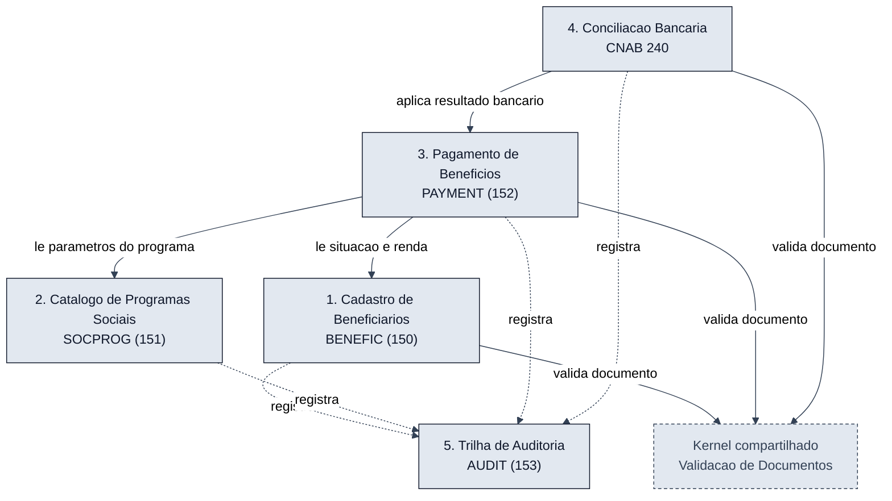

# Mapa de contextos delimitados — SIFAP 2.0

> **Trilha:** [Kit do Time](../README.md) › [Estágio 2](README.md) › **Contextos delimitados**

**Artefato produzido por `/carve-bounded-contexts` a partir de [`01-archaeology/discovery-report.md`](../01-archaeology/discovery-report.md).**

| Campo | Valor |
|---|---|
| **Público-alvo** | Dupla 2 (Arquiteto de Software + Especialista em Requisitos) |
| **Entrada** | [`discovery-report.md`](../01-archaeology/discovery-report.md), [`dependency-map.md`](../01-archaeology/dependency-map.md), [`business-rules-catalog.md`](../01-archaeology/business-rules-catalog.md) |
| **Estágio** | Estágio 2 — Especificação moderna |
| **Status** | **Aceito pela equipe** em 2026-09-10, com os dois ajustes propostos |
| **Data** | 2026-09-10 |

> [!IMPORTANT]
> A arquitetura-alvo é um **Monólito Modular**: uma única unidade implantável, com módulos separados por contexto e comunicação **em processo** por interfaces Java. Nenhum contexto vira serviço implantável separadamente.

---

## Critérios de avaliação

| Critério | Como foi medido |
|---|---|
| **Coesão** | As regras confirmadas do agrupamento representam a mesma capacidade de negócio? Fonte: [`business-rules-catalog.md`](../01-archaeology/business-rules-catalog.md). |
| **Acoplamento** | Quantas arestas (`CALLNAT`, `INCLUDE`, acesso a DDM) cruzam a fronteira proposta? Fonte: as 67 arestas de [`dependency-map.md`](../01-archaeology/dependency-map.md). |
| **Frequência de mudança** | Aproximada por conectividade e por sinais no código (chamados abertos, comentários de pendência, divergências com a documentação de 2012). |

---

## Avaliação das hipóteses

### Hipótese 1 — Cadastro de Beneficiários — **ACEITA COM AJUSTE**

| Critério | Avaliação | Evidência |
|---|---|---|
| Coesão | **Alta** | Único agrupamento que grava em `BENEFIC` (150): `CADBENEF.NSP:295-310`, `CADDEPEN` (`FIND UPDATE BENEFIC`). Regras confirmadas de obrigatoriedade cadastral em `CADBENEF.NSP:145-186`. |
| Acoplamento | **Médio** | Os subprogramas de validação são chamados de fora do agrupamento: `BATCHPGT.NSP:276`, `CALCCORR.NSP:160`, `CONSBENF.NSP:136` chamam `SUBVALCP`; `VALDOCS.NSP:109` chama `SUBVALNI`. |
| Frequência de mudança | **Baixa** | Regras cadastrais estáveis e corroboradas pelo Doc §1.1 (RN-001, RN-006). |

**Ajuste:** `SUBVALCP.NSN`, `SUBVALNI.NSN` e `CCVALCPF.NSC` **não pertencem** ao contexto de cadastro. São subprogramas corporativos consumidos por três contextos distintos; mantê-los dentro do cadastro criaria dependência de Pagamento e Consulta sobre o cadastro apenas para validar um documento. Vão para o **kernel compartilhado** (ver abaixo). `VALBENEF.NSN` permanece no contexto: só é chamado por `CADBENEF.NSP:263`.

### Hipótese 2 — Catálogo de Programas Sociais — **ACEITA**

| Critério | Avaliação | Evidência |
|---|---|---|
| Coesão | **Alta** | `CADPROG.NSP` é o único escritor de `SOCPROG` (151): `CADPROG -->|FIND STORE| SOCPROG`. |
| Acoplamento | **Baixo** | Só há leituras cruzando a fronteira: `BATCHPGT -->|FIND| SOCPROG`, `CALCBENF -->|FIND| SOCPROG`, `VALELEG -->|FIND| SOCPROG`. Nenhuma escrita externa. |
| Frequência de mudança | **Alta** | 45 registros de parâmetros (faixas de cálculo, fator regional, renda máxima) que mudam por ato normativo, enquanto o motor de cálculo permanece estável. Justamente por isso merece fronteira própria. |

**Nota de risco herdada:** as faixas de renda e a tabela de fator regional existem em `SOCPROG`, em `LDASIFAP.NSL` e **reescritas literalmente** em `CALCBENF.NSN` e `BATCHPGT.NSP` ([discovery-report §3.2](../01-archaeology/discovery-report.md)). O contexto novo passa a ser a fonte única; a duplicação legada vira questão em aberto de migração, não requisito.

### Hipótese 3 — Cálculo e Geração de Pagamento — **ACEITA**

| Critério | Avaliação | Evidência |
|---|---|---|
| Coesão | **Alta** | Concentra elegibilidade, valor bruto, descontos e correção: `VALELEG.NSN:114-118`, `CALCBENF.NSN:344-352`, `CALCDSCT.NSP:107-111`, `BATCHPGT.NSP:558-566`. Todas as gravações em `PAYMENT` (152) nascem aqui. |
| Acoplamento | **Alto, mas dirigido** | `BATCHPGT` chama `SUBVALCP` (`:276`), `VALELEG` (`:369`) e `CALCBENF` (`:381`); lê `BENEFIC` e `SOCPROG`. Cruzam a fronteira apenas **leituras** de outros contextos e uma chamada ao kernel compartilhado. |
| Frequência de mudança | **Alta** | Quatro das cinco questões de impacto financeiro estão neste agrupamento (duplicidade de pagamento, renda per capita, índice de macrorregião, 13º), incluindo o chamado aberto `BATCHPGT.NSP:363-367` (TICKET 6622/2011). |

**Nota:** `CALCDSCT.NSP` e `CALCCORR.NSP` não têm chamador identificado no corpus. Permanecem no contexto porque atualizam `PAYMENT`, mas o gatilho de execução é questão em aberto.

### Hipótese 4 — Conciliação Bancária — **ACEITA COM AJUSTE**

| Critério | Avaliação | Evidência |
|---|---|---|
| Coesão | **Alta** | `BATCHCON.NSP` é o único ponto de integração externa por arquivo CNAB 240 e o único tradutor de código de retorno bancário para situação de pagamento: `BATCHCON.NSP:204-231`. |
| Acoplamento | **Médio** | Cruza a fronteira com `FIND UPDATE PAYMENT` (`BATCHCON.NSP:171-225`) e `READ STORE AUDIT` (`:116`, `:345`). |
| Frequência de mudança | **Média** | Muda com o layout do banco e o calendário bancário, em ritmo diferente das regras de valor. |

**Ajuste:** o contexto **não é dono** da tabela `PAYMENT`. Ele recebe o retorno bancário e solicita a transição de situação pela interface pública de Pagamento de Benefícios. Motivo: o mesmo campo de situação tem **três vocabulários divergentes** — `PAYMENT.ddm:73-75`, `BATCHCON.NSP:204-231` e `BATCHREL.NSP:177-190` ([regra 5 de `BATCHCON`](../01-archaeology/business-rules-catalog.md)). Duas escritas concorrentes sobre um domínio ainda não resolvido é exatamente o defeito que a fronteira precisa impedir. A definição da máquina de estados é candidata a ADR.

### Hipótese 5 — Trilha de Auditoria — **ACEITA**

| Critério | Avaliação | Evidência |
|---|---|---|
| Coesão | **Alta** | Escrita centralizada em um copycode (`CCAUDIT.NSC:7-10`) e leitura por um único relatório (`RELAUDIT -->|READ HISTOGRAM| AUDIT`). |
| Acoplamento | **Alto por design** | 7 arestas `INCLUDE` (`BATCHPGT:594`, `BATCHCON:345`, `CADBENEF:418`, `CADDEPEN:235`, `CADPROG:176`, `CALCCORR:243`, `CONSBENF:314`). Acoplamento unidirecional e sempre no mesmo sentido: todos escrevem, ninguém lê o modelo alheio. |
| Frequência de mudança | **Baixa** | Formato preso a exigência legal: retenção imutável de 10 anos (`AUDIT.ddm:14-18`, IN-TCU 63/2010, Lei 8.159 art. 14). |

### Hipótese implícita — Consultas e Relatórios — **REJEITADA como contexto**

| Critério | Avaliação | Evidência |
|---|---|---|
| Coesão | **Baixa** | `CONSBENF`, `RELPGT` e `BATCHREL` só leem, e leem de contextos diferentes ao mesmo tempo: `RELPGT -->|READ| PAYMENT` e `RELPGT -->|FIND| BENEFIC`. |
| Acoplamento | **Muito alto** | Toda leitura cruza fronteira; o agrupamento não seria dono de nenhum dado. |
| Frequência de mudança | **Alta e derivada** | Muda porque os contextos-fonte mudam, nunca por regra própria. |

**Justificativa da rejeição:** um contexto delimitado é definido pela propriedade de um modelo, não por um verbo. Estes programas viram **modelos de leitura** dentro dos contextos 1, 3 e 5. `BATCHREL.NSP`, que lê de dois contextos, torna-se um relatório de composição na camada de aplicação.

### Ajuste transversal — Validação de Documentos — **KERNEL COMPARTILHADO, não contexto**

| Critério | Avaliação | Evidência |
|---|---|---|
| Coesão | **Alta** | `CCVALCPF.NSC:94-127` (módulo 11) e `SUBVALCP.NSN:74-78` (retorno 1001) formam uma única capacidade técnica. |
| Acoplamento | **Alto e centrípeto** | 4 chamadores em 3 contextos: `BATCHPGT:276`, `CADBENEF:161`, `CALCCORR:160`, `CONSBENF:136`. |
| Frequência de mudança | **Muito baixa** | Algoritmo definido por norma externa (Receita Federal), imutável desde 1997. |

**Justificativa:** não é uma capacidade de negócio própria do SIFAP e não possui dados. Vira **kernel compartilhado** — tipos e validadores sem estado, consumidos por qualquer contexto. Promovê-lo a contexto criaria uma fronteira sem modelo.

---

## Contextos delimitados finais

### 1. Cadastro de Beneficiários

| Campo | Valor |
|---|---|
| **Responsabilidade** | Manter a identidade e a situação cadastral do beneficiário e de seus dependentes: inclusão, alteração, situação e vínculo com programa. |
| **Dados próprios** | `BENEFIC.ddm` (FNR 150, 4,2 milhões de registros), incluindo o grupo periódico de dependentes 1:10. |
| **Interface pública** | `BeneficiaryQuery.findByCpf(Cpf): BeneficiarySnapshot` `BeneficiaryRegistration.register(RegistrationCommand): RegistrationResult` Evento `BeneficiaryStatusChanged` |
| **Por que é contexto próprio** | Coesão alta com propriedade exclusiva de escrita em `BENEFIC`; nenhum outro contexto grava neste arquivo em todo o corpus legado. |
| **Programas legados** | `CADBENEF.NSP`, `CADDEPEN.NSP`, `VALBENEF.NSN`, `VALDOCS.NSP`, `CONSBENF.NSP` (modelo de leitura) |

### 2. Catálogo de Programas Sociais

| Campo | Valor |
|---|---|
| **Responsabilidade** | Ser a fonte única dos parâmetros de programa: situação do programa, faixas de renda e fatores, renda máxima, parâmetros regionais e vigência. |
| **Dados próprios** | `SOCPROG.ddm` (FNR 151, 45 registros), com os grupos periódicos de 5 faixas de cálculo e 1:6 parâmetros regionais. |
| **Interface pública** | `SocialProgramCatalog.findActive(ProgramCode, Competence): ProgramParameters` `SocialProgramCatalog.isActive(ProgramCode, Competence): boolean` |
| **Por que é contexto próprio** | Escritor único e cadência de mudança normativa distinta do motor de cálculo; isolá-lo elimina os parâmetros duplicados hoje cravados em `LDASIFAP.NSL`, `CALCBENF.NSN` e `BATCHPGT.NSP`. |
| **Programas legados** | `CADPROG.NSP` |

### 3. Pagamento de Benefícios

| Campo | Valor |
|---|---|
| **Responsabilidade** | Decidir elegibilidade, calcular valor bruto, descontos e correções, gerar a folha da competência e ser o dono da máquina de estados do pagamento. |
| **Dados próprios** | `PAYMENT.ddm` (FNR 152, 612 milhões de registros), com o grupo periódico de 8 descontos e o superdescritor `S1` (CPF + competência). |
| **Interface pública** | `PayrollGeneration.run(Competence): PayrollResult` `BenefitCalculation.calculate(Cpf, Competence): BenefitAmount` `PaymentStatus.applyBankOutcome(PaymentId, BankOutcome): void` Evento `PaymentIssued` |
| **Por que é contexto próprio** | Concentra todas as escritas em `PAYMENT` e todas as regras de valor; é o núcleo do domínio e onde estão as quatro questões de impacto financeiro. |
| **Programas legados** | `BATCHPGT.NSP`, `VALELEG.NSN`, `CALCBENF.NSN`, `CALCDSCT.NSP`, `CALCCORR.NSP`, `RELPGT.NSP` e `BATCHREL.NSP` (modelos de leitura) |

### 4. Conciliação Bancária

| Campo | Valor |
|---|---|
| **Responsabilidade** | Gerar a remessa e interpretar o retorno CNAB 240, traduzindo código de retorno bancário em resultado de crédito. |
| **Dados próprios** | Registro de remessa e retorno (arquivos `CMWKF01` de remessa/retorno). **Não possui `PAYMENT`.** |
| **Interface pública** | `BankReconciliation.importReturnFile(ReturnFile): ReconciliationSummary` — consome `PaymentStatus.applyBankOutcome` do contexto 3. |
| **Por que é contexto próprio** | Único ponto de integração externa, acoplado por arquivo e não por chamada; muda com o layout bancário, não com a regra de valor. |
| **Programas legados** | `BATCHCON.NSP` |

### 5. Trilha de Auditoria

| Campo | Valor |
|---|---|
| **Responsabilidade** | Registrar de forma imutável quem alterou o quê e quando, e disponibilizar a consulta da trilha. |
| **Dados próprios** | `AUDIT.ddm` (FNR 153, 418 milhões de registros) e as partições 154/155/156 sem DDM publicado. |
| **Interface pública** | `AuditTrail.record(AuditEntry): void` (somente escrita, sem retorno de domínio) `AuditQuery.search(AuditCriteria): Page<AuditEntry>` |
| **Por que é contexto próprio** | Escrita centralizada já no legado, modelo próprio e obrigação legal de imutabilidade por 10 anos que não pode depender do ciclo de vida de outro contexto. |
| **Programas legados** | `CCAUDIT.NSC`, `RELAUDIT.NSP` |

### Kernel compartilhado — Validação de Documentos

| Campo | Valor |
|---|---|
| **Responsabilidade** | Tipos de valor e validadores sem estado para CPF e NIS/PIS/PASEP, com os códigos de retorno legados. |
| **Dados próprios** | Nenhum. |
| **Interface pública** | `Cpf.of(String)`, `CpfValidator.validate(String): ValidationCode`, `NisValidator.validate(String): ValidationCode` |
| **Por que não é contexto** | Não representa capacidade de negócio nem possui modelo; é regra externa estável consumida por 3 contextos. |
| **Programas legados** | `CCVALCPF.NSC`, `SUBVALCP.NSN`, `SUBVALNI.NSN` |

---

## Comunicação entre contextos

Toda comunicação é **em processo**, dentro da mesma JVM. Nunca HTTP entre módulos.

| De | Para | Mecanismo | Dados trocados |
|---|---|---|---|
| Pagamento de Benefícios | Cadastro de Beneficiários | Chamada em processo por interface (`BeneficiaryQuery`) | CPF, situação, data de nascimento, renda familiar, programa vinculado, UF/região |
| Pagamento de Benefícios | Catálogo de Programas Sociais | Chamada em processo por interface (`SocialProgramCatalog`) | Código do programa e competência → faixas, fatores, renda máxima, situação |
| Conciliação Bancária | Pagamento de Benefícios | Chamada em processo por interface (`PaymentStatus`) | Identificador do pagamento, código de retorno bancário, data de crédito |
| Cadastro de Beneficiários | Trilha de Auditoria | Chamada em processo por interface (`AuditTrail`) | Ação (`IN`/`AL`), usuário, data/hora, chave do registro, valores antes e depois |
| Catálogo de Programas Sociais | Trilha de Auditoria | Chamada em processo por interface (`AuditTrail`) | Idem |
| Pagamento de Benefícios | Trilha de Auditoria | Chamada em processo por interface (`AuditTrail`) | Idem, com ação de lote (`BT`) |
| Conciliação Bancária | Trilha de Auditoria | Chamada em processo por interface (`AuditTrail`) | Idem |
| Cadastro, Pagamento, Conciliação | Kernel compartilhado | Chamada direta a tipo sem estado | String de documento → código de validação |

> [!NOTE]
> A dependência sobre Trilha de Auditoria é **unidirecional e sem retorno de domínio**: nenhum contexto lê o modelo de auditoria para decidir regra de negócio. Isso preserva a imutabilidade exigida por `AUDIT.ddm:14-18`.

Legenda: seta cheia = chamada em processo com retorno de domínio; seta tracejada = escrita unidirecional na trilha; caixa tracejada = kernel compartilhado sem dados próprios.

---

## Decisões candidatas a ADR

| # | Decisão | Por que precisa de ADR | Situação |
|---|---|---|---|
| 1 | Propriedade da situação do pagamento entre Pagamento de Benefícios e Conciliação Bancária | Três vocabulários divergentes para o mesmo campo (`PAYMENT.ddm:73-75`, `BATCHCON.NSP:204-231`, `BATCHREL.NSP:177-190`) | Candidata — depende da questão em aberto sobre o domínio da situação |
| 2 | Mapeamento dos grupos periódicos Adabas (dependentes 1:10, descontos 1:8, faixas 1:5) para JPA | `@ElementCollection`, `@OneToMany` e coluna JSONB são todas viáveis, com trade-offs distintos | Decidida para o grupo de descontos em [`ADR-001`](ADRs/adr-001-payment-discount-jpa-mapping.md); dependentes e faixas seguem candidatos |
| 3 | Estratégia de coexistência com o legado (Strangler Fig) por contexto | Define qual contexto migra primeiro e como a base histórica de 612 milhões de pagamentos é lida | Candidata — bloqueada por P4b, ver [`ADR-002`](ADRs/adr-002-payment-uniqueness-cpf-competence.md) |
| 4 | Quantos pagamentos a folha nova gera por CPF e competência | Guarda de reentrância e restrição de unicidade são decisões distintas, e só a primeira é fundamentada em requisito | Decidida em [`ADR-002`](ADRs/adr-002-payment-uniqueness-cpf-competence.md) para o processamento novo (P4a); carga histórica (P4b) aberta |

---

## Questões em aberto herdadas do Estágio 1

Nenhuma foi respondida por esta análise. Permanecem com status `aberta` em [`mysteries-found.md`](../01-archaeology/mysteries-found.md) e **não podem virar requisito** sem validação humana.

| Questão | Contexto afetado |
|---|---|
| Duplicidade de pagamento por CPF e competência (`BATCHPGT.NSP:381`, `:488`) — dividida em **P4a**, processamento novo, decidida em [`ADR-002`](ADRs/adr-002-payment-uniqueness-cpf-competence.md), e **P4b**, carga histórica, aberta | 3. Pagamento de Benefícios |
| Renda familiar total usada onde a documentação exige per capita (`CALCBENF.NSN:174`) | 3. Pagamento de Benefícios (lê do contexto 1) |
| Código de macrorregião indexando tabela de 27 unidades federativas (`CALCBENF.NSN:200`) | 3. Pagamento de Benefícios (lê do contexto 2) |
| Óbito e bloqueios judiciais não consultados antes do pagamento (`BATCHPGT.NSP:263`) | 1. Cadastro e 3. Pagamento |
| Fórmula do 13º benefício (`CALCBENF.NSN:271`, `:277`) | 3. Pagamento de Benefícios |
| Domínio real da situação do pagamento (`BATCHCON.NSP:204-231`) | 3. Pagamento e 4. Conciliação |
| Gatilho de execução de `CALCDSCT.NSP` e `CALCCORR.NSP` (sem chamador no corpus) | 3. Pagamento de Benefícios |

---

## Ratificação da equipe

- Revisado por: Equipe SIFAP 2.0 — Dupla 2 (Arquiteto de Software + Especialista em Requisitos)
- Data: 2026-09-10
- Decisão: **aceita como está**, incluindo o kernel compartilhado de Validação de Documentos e a propriedade exclusiva de `PAYMENT` pelo contexto de Pagamento de Benefícios
- Registro: [`scope-decisions.md`](scope-decisions.md)

---

## Definição de pronto

- [x] Cada hipótese avaliada por coesão, acoplamento e frequência de mudança
- [x] Rejeições com justificativa registrada
- [x] Entre dois e cinco contextos definidos com nomes de negócio
- [x] Cada contexto com responsabilidade, dados próprios e interface pública
- [x] Diagrama Mermaid com relações e caminhos de comunicação
- [x] Ratificação da equipe registrada

---

### Continue lendo

| Anterior | Próximo |
|---|---|
| [Relatório de descoberta](../01-archaeology/discovery-report.md) Base de evidência do Estágio 1. | [Decisões de escopo](scope-decisions.md) O que entra e o que fica adiado. |

[Voltar ao índice do kit](../README.md)
