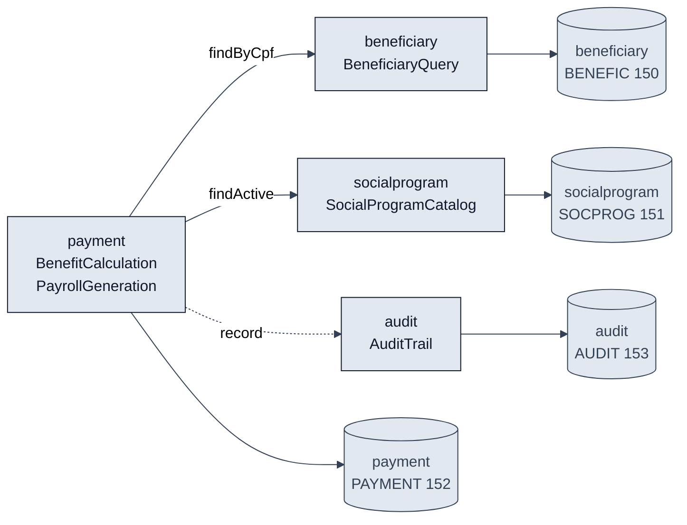

# Plano — 001-benefit-calculation

> **Feature:** `001-benefit-calculation`
> **Branch:** `spec/001-benefit-calculation`
> **Data:** 2026-09-10
> **Entradas:** [`spec.md`](spec.md), [`bounded-contexts.md`](../../02-modern-spec/bounded-contexts.md), [`ADR-001`](../../02-modern-spec/ADRs/adr-001-payment-discount-jpa-mapping.md), [`ADR-002`](../../02-modern-spec/ADRs/adr-002-payment-uniqueness-cpf-competence.md), [`scope-decisions.md`](../../02-modern-spec/scope-decisions.md)

Todos os 14 REQ-IDs de [`spec.md`](spec.md) possuem `source_legacy:` conferido. Este plano descreve **somente** a estrutura necessária para liberar a primeira tarefa de implementação.

---

## Questão de projeto que este plano responde

> Qual módulo possui os dados de `PAYMENT`, e como o cálculo do benefício obtém a situação e a renda do beneficiário e os parâmetros do programa sem que outro módulo grave em `PAYMENT`?

**Resposta:** o módulo `payment` é o único proprietário de `PAYMENT` e a única origem de escrita. Ele obtém situação, renda e dependentes por `BeneficiaryQuery` e os parâmetros do programa por `SocialProgramCatalog`, ambas interfaces Java chamadas em processo, sem acesso direto às tabelas alheias. Nenhuma chamada HTTP entre módulos.

---

## Módulos (Monólito Modular)

Pacote raiz: `br.gov.sifap`. Cada módulo tem `domain/`, `application/` e `infrastructure/`. Só o que está na tabela é criado nesta feature.

| Módulo | Responsabilidade | Dados próprios (DDM) | Interface em processo | Atende ao REQ-ID |
|---|---|---|---|---|
| `payment` | Avaliar elegibilidade, calcular valor bruto, descontos e líquido, gerar o pagamento e executar a folha da competência | `PAYMENT.ddm` (FNR 152) | `BenefitCalculation`, `PayrollGeneration` (expostas); `EligibilityPolicy`, `DiscountPolicy` (internas) | REQ-001 a REQ-013 |
| `beneficiary` | Fornecer, **somente leitura** nesta feature, a situação, a renda considerada, a data de nascimento, a quantidade de dependentes e o programa vinculado | `BENEFIC.ddm` (FNR 150) | `BeneficiaryQuery` (consumida) | REQ-002, REQ-003, REQ-004, REQ-005, REQ-009 |
| `socialprogram` | Fornecer, **somente leitura** nesta feature, a situação do programa, o teto de renda e as faixas de renda com seus fatores | `SOCPROG.ddm` (FNR 151) | `SocialProgramCatalog` (consumida) | REQ-001, REQ-003, REQ-005 |
| `audit` | Registrar a trilha de auditoria de forma unidirecional e imutável | `AUDIT.ddm` (FNR 153) | `AuditTrail` (consumida) | REQ-014 |
| `sharedkernel` | Tipos de valor sem estado usados por mais de um módulo: `Cpf`, `Competence`, `Money` | Nenhum | Tipos diretos | REQ-006, REQ-010, REQ-011 |

> [!NOTE]
> `beneficiary`, `socialprogram` e `audit` entram nesta feature **apenas com a superfície de leitura ou escrita que `payment` consome**. Cadastro, manutenção e consulta desses contextos permanecem adiados em [`scope-decisions.md`](../../02-modern-spec/scope-decisions.md).

---

## Comunicação entre módulos



Seta cheia: chamada em processo com retorno de domínio. Seta tracejada: escrita unidirecional, sem retorno de domínio. Nenhum módulo alcança a tabela de outro.

---

## Contratos em processo necessários à primeira tarefa

Assinaturas mínimas. Tipos de retorno são objetos de valor imutáveis, nunca entidades JPA de outro módulo.

```java
// br.gov.sifap.beneficiary.api
public interface BeneficiaryQuery {
    Optional<BeneficiarySnapshot> findByCpf(Cpf cpf);
}

public record BeneficiarySnapshot(
        Cpf cpf,
        BeneficiaryStatus status,   // A, S, C, D, I
        Money consideredIncome,     // ver questão de projeto P1
        LocalDate birthDate,
        int dependentCount,
        String programCode,
        String regionCode) { }
```

```java
// br.gov.sifap.socialprogram.api
public interface SocialProgramCatalog {
    Optional<ProgramParameters> findActive(String programCode, Competence competence);
}

public record ProgramParameters(
        String programCode,
        boolean active,
        Money baseAmount,
        Money maxIncome,            // zero desliga a verificação — REQ-003
        List<IncomeBand> incomeBands,  // ordem crescente de teto — REQ-005
        BigDecimal adjustmentFactor) { }

public record IncomeBand(Money ceiling, BigDecimal factor) { }
```

```java
// br.gov.sifap.audit.api
public interface AuditTrail {
    void record(AuditEntry entry);  // sem retorno de domínio — REQ-014
}
```

```java
// br.gov.sifap.payment.api
public interface BenefitCalculation {
    CalculationResult calculate(Cpf cpf, Competence competence);
}

public interface PayrollGeneration {
    PayrollResult run(Competence competence);  // exitCode 0, 4, 8 ou 12 — REQ-012, REQ-013
}
```

---

## Modelo de dados de `payment`

Decorre de [`ADR-001`](../../02-modern-spec/ADRs/adr-001-payment-discount-jpa-mapping.md) e de [`ADR-002`](../../02-modern-spec/ADRs/adr-002-payment-uniqueness-cpf-competence.md).

| Tabela | Origem legada | Observação |
|---|---|---|
| `payment` | `PAYMENT.ddm` campos `AA`–`EG` | REQ-010 é atendido pela **consulta prévia** por CPF + competência, que espelha `BATCHPGT.NSP:L292-L298`. O **índice único** sobre o par é decisão adicional de projeto, estritamente mais forte que REQ-010, registrada em [`ADR-002`](../../02-modern-spec/ADRs/adr-002-payment-uniqueness-cpf-competence.md) |
| `payment_discount` | grupo periódico `GRP-DISC (1:8)`, `PAYMENT.ddm:L47-L55` | `@OneToMany` a partir de `Payment`; sem repositório público; construtor de pacote |

Regras de mapeamento que a primeira tarefa precisa respeitar:

- Valores monetários usam `BigDecimal` com escala 2 e `RoundingMode.DOWN`, nunca `HALF_UP` — REQ-006 exige truncamento, e a divergência de arredondamento com `BATCHREL.NSP:L166` é questão em aberto que não pode ser fechada por escolha de implementação.
- A competência é `YYYYMM`, refletindo `YEAR-MONTH-REF (N6)`.
- O limite de 8 descontos por pagamento é reafirmado na aplicação; o Adabas o garantia por estrutura e o modelo relacional não.
- **A guarda de reentrada e o índice único são coisas distintas.** A guarda de REQ-010 é uma consulta executada antes de processar o beneficiário e sozinha satisfaz os critérios de aceitação do requisito. No legado, a guarda (`BATCHPGT.NSP:L292-L298`) e a dupla gravação da mesma iteração (`CALCBENF.NSN:L319`, depois `BATCHPGT.NSP:L488`) coexistem sem contradição, porque a guarda nunca enxerga a segunda gravação. O índice único cobre esse caso adicional, sobre o qual REQ-010 não se pronuncia.
- O índice único vive em **migração Flyway própria**, separada do DDL da tabela, para que P4b possa ser revertida sem tocar no mapeamento JPA nem nas entidades.

---

## Ordem de implementação sugerida

| # | Trabalho | Rastreabilidade | Depende de |
|---|---|---|---|
| 1 | `sharedkernel`: `Cpf`, `Competence`, `Money` com truncamento | REQ-006 | — |
| 2 | `payment`: entidades `Payment` e `PaymentDiscount` | — | 1 |
| 2b | Guarda de reentrada: consulta por CPF + competência antes de gerar o pagamento | REQ-010 | 2 |
| 2c | Índice único `(cpf, competence)` em migração Flyway isolada e revertível | P4a, [`ADR-002`](../../02-modern-spec/ADRs/adr-002-payment-uniqueness-cpf-competence.md) | 2 |
| 3 | Contratos `BeneficiaryQuery` e `SocialProgramCatalog` com implementação de leitura | — | 1 |
| 4 | `EligibilityPolicy` | REQ-001, REQ-002, REQ-003 | 2, 3 |
| 5 | `BenefitCalculation`: fator de renda, truncamento e recusa de inativo | REQ-004, REQ-005, REQ-006 | 4 |
| 6 | `DiscountPolicy`: teto de 30% e isenção judicial | REQ-007, REQ-008 | 2, 5 |
| 7 | `PayrollGeneration`: competência, ignorados, códigos de retorno e rollback | REQ-009, REQ-011, REQ-012, REQ-013 | 5, 6 |
| 8 | `AuditTrail` acionado na gravação do pagamento | REQ-014 | 2, 7 |

Testes são escritos junto de cada item, com o REQ-ID citado em comentário inline no teste.

Os itens 2b e 2c têm testes **separados**, e o comentário inline distingue um do outro: o teste do item 2b cita `REQ-010` porque protege comportamento fundamentado no legado; o do item 2c cita `P4a` porque protege uma suposição de projeto que pode ser revertida. Sem essa separação, derrubar o índice único faria falhar um teste rotulado como requisito.

---

## Questões de projeto em aberto

- **P1:** qual renda o contrato `BeneficiarySnapshot.consideredIncome` transporta — familiar total ou per capita? O nome do campo do programa é `MAX-PERCAP-INCOME` e o valor comparado é a renda familiar (`VALELEG.NSN:L174-L180`, `BENEFIC.ddm:L96`) — responsável: SENARC/CGPB, status: aberta.
- **P2:** `DiscountPolicy` é executada dentro de `PayrollGeneration` ou apenas em operação avulsa? Não existe chamada a `CALCDSCT.NSP` em nenhum módulo do corpus (`BATCHPGT.NSP:L20`, `CALCDSCT.NSP:L74`) — responsável: a definir pela dupla, status: aberta.
- **P3:** qual é o domínio de `PaymentStatus`? Três vocabulários divergentes (`PAYMENT.ddm:L73-L75`, `CALCBENF.NSN:L308-L320`, `BATCHREL.NSP:L177-L190`). A primeira tarefa **não** define a máquina de estados; grava o pagamento com o estado que a equipe validar — responsável: a definir pela dupla, status: aberta.
- **P4a:** a folha **nova** gera um ou dois pagamentos por CPF e competência? **Decidida: um.** Nenhum requisito desta feature pede o segundo pagamento, e a dupla gravação legada está classificada como Mistério sob chamado aberto: `BATCHPGT.NSP:L363-367` registra "THE INLINE CALCULATION BELOW REMAINS ACTIVE PENDING A DECISION - TICKET 6622/2011 OPEN". Reproduzir um defeito sob chamado aberto exigiria requisito próprio, que não existe. Reversível pelo item 2c — responsável: dupla 2, registrada em [`ADR-002`](../../02-modern-spec/ADRs/adr-002-payment-uniqueness-cpf-competence.md), status: decidida.
- **P4b:** a base histórica migrada de `PAYMENT` admite pares CPF/competência duplicados? Se os 612 milhões de registros contiverem pares repetidos, a carga falha no índice único do item 2c. Afeta também a ADR de coexistência Strangler Fig e depende de P3: se a máquina de estados admitir cancelamento com reemissão na mesma competência, o índice único simples bloqueia a reemissão e precisa virar índice parcial. **Não pode ser fechada por decisão de implementação** — responsável: Coordenação de Benefícios, conforme `BATCHPGT.NSP:L365`, status: aberta.
- **P5:** os fatores regional, familiar e etário estão todos classificados como Mistério e **não** têm requisito. O cálculo da primeira tarefa cobre apenas o fator de renda (REQ-005); os demais ficam como ponto de extensão explícito, não como valor 1,0 implícito — responsável: a definir pela dupla, status: aberta.

> [!IMPORTANT]
> P1, P3 e P5 afetam o valor pago; P4b bloqueia a carga histórica. A primeira tarefa é implementável porque nenhum requisito desta feature depende da resposta, mas nenhuma delas pode ser fechada por decisão de implementação.

### Evidência a coletar antes do Estágio 3

P4b se resolve mais rápido com um número do que com uma pergunta: **quantos pares `(NUM-CPF, YEAR-MONTH-REF)` duplicados existem hoje em `PAYMENT` (FNR 152)?** Zero torna P4b formalidade; qualquer valor acima disso dimensiona o trabalho de carga. O visor legado expõe apenas `VIEWBENF`, que é somente leitura sobre beneficiários, então a contagem depende do facilitador ou da Coordenação de Benefícios.

---

## Definição de pronto

- [x] Descreve somente o necessário à feature
- [x] Toda decisão tem evidência ou questão explícita em aberto
- [x] Artefatos de apoio vinculados
- [ ] Duplas 3 e 4 confirmaram que conseguem iniciar a primeira tarefa sem criar escopo adicional
